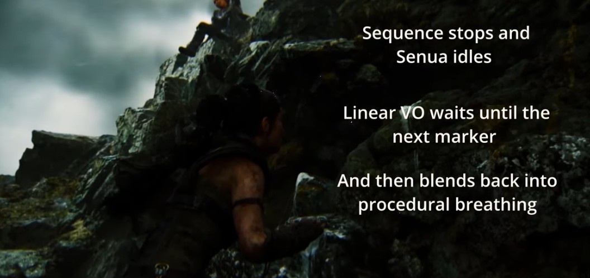

# How Hellblade does it in audio

Some references and notes on how Hellblade did their audio for presenting the inner voices.

## GDC talk from Hellblade dev

https://gdcvault.com/play/1024922/Breaking-Through-Psychosis-and-the

This is more on the design side. The inner voice and mental state stuff begins from about 00:41:28. They mentioned according to expert consultants, the voices are ”all around in 3d, sometimes are in very specific positions (around the mental state carrier in their imaginary space), sometimes distorted, sometimes in different languages”.

There is a clip as reference from 00:46:30. It is also a demonstration of the intended-to-be-conveyed feeling of “the thing that hurts the most for her (a consultant) is in a beautiful state of mind… then it kind of gets pull from under your feet… when you are not prepared for what’s coming”.

So generally I think the project owner referred to Hellblade in the hope that this technique can be used to create “stream of consciousness” narrative effect for the schizophrenia-carrying protagonist of his game.

## Audio design interview with Gamradar

https://www.gamesradar.com/ninja-theory-hellblade-senuas-sacrifice-psychosis-interview/

They mentioned

> …playing with the idea of association with the trees swaying based on the [player’s] movements. This was Paul telling us that often people with psychosis see agency in the branches of the trees, so the things that we see naturally moving in the wind, they would see as moving of their own free will.
> 

It is interesting psychological concept to deliver to the player, but I don’t think this specific presentation would work well in a stealth action game. But the idea is interesting.

## Audio specific tech intro

[Game Developer How Ninja Theory created Hellblade II's unsettling soundscap…](https://www.youtube.com/watch?v=bj5G56bwyEg)

Briefly mentioned binaural audio usage, attenuation, etc.

