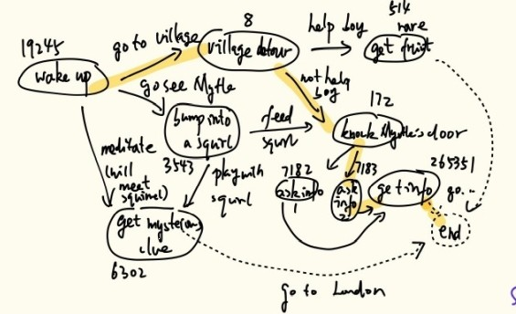

<!-- TOC -->

- [Data structures](#data-structures)
    - [At a glance](#at-a-glance)
    - [Data-oriented classes](#data-oriented-classes)
        - [CommonNode](#commonnode)
        - [DialogueNode](#dialoguenode)
        - [DialogueLink](#dialoguelink)
        - [CharBarkNode](#charbarknode)
        - [SurrBarkNode](#surrbarknode)
    - [Organizational Structures](#organizational-structures)
        - [DialogueGraph](#dialoguegraph)
        - [DialogueSequence](#dialoguesequence)
    - [Recording](#recording)
        - [ConversationInstance](#conversationinstance)
- [Theoretical Test Scenarios](#theoretical-test-scenarios)
    - [Scenario 1: Short Story Dialogue](#scenario-1-short-story-dialogue)
        - [Context](#context)
        - [DialogueGraph](#dialoguegraph)
        - [Dialogue Nodes](#dialogue-nodes)
            - [dialogue node id: 19245](#dialogue-node-id-19245)
            - [dialogue link id: 1262](#dialogue-link-id-1262)
            - [dialogue link id: 1263](#dialogue-link-id-1263)
            - [dialogue link id: 1264](#dialogue-link-id-1264)
            - [dialogue node id: 8](#dialogue-node-id-8)
            - [dialogue link id: 1265](#dialogue-link-id-1265)
            - [dialogue link id: 1266](#dialogue-link-id-1266)
            - [dialogue node id: 514](#dialogue-node-id-514)
            - [dialogue link id: 1267](#dialogue-link-id-1267)
            - [dialogue node id: 172](#dialogue-node-id-172)
            - [dialogue link id: 1268](#dialogue-link-id-1268)
            - [dialogue link id: 1269](#dialogue-link-id-1269)
            - [dialogue node id: 7182](#dialogue-node-id-7182)
            - [dialogue link id: 1270](#dialogue-link-id-1270)
            - [dialogue link id: 1271](#dialogue-link-id-1271)
            - [dialogue node id: 7183](#dialogue-node-id-7183)
            - [dialogue link id: 1272](#dialogue-link-id-1272)
            - [dialogue node id: 265351](#dialogue-node-id-265351)
            - [dialogue link id: 1273](#dialogue-link-id-1273)
            - [dialogue node id: 3543](#dialogue-node-id-3543)
            - [dialogue link id: 1274](#dialogue-link-id-1274)
            - [dialogue link id: 1275](#dialogue-link-id-1275)
            - [dialogue node id: 6302](#dialogue-node-id-6302)
            - [dialogue link id: 1276](#dialogue-link-id-1276)
            - [dialogue node id: end](#dialogue-node-id-end)
        - [Scenario 1 Theoretical Run](#scenario-1-theoretical-run)
            - [Dialogue sequence id: p0065167390](#dialogue-sequence-id-p0065167390)
    - [Scenario 2: Guard Barks in a Level](#scenario-2-guard-barks-in-a-level)
        - [Guard AI State Machine](#guard-ai-state-machine)
            - [AI States (not behavior states)](#ai-states-not-behavior-states)
            - [Valid transitions](#valid-transitions)
        - [Internal Variables (world / AI accessible)](#internal-variables-world--ai-accessible)
        - [Bark Triggers (for CharBarkNode testing)](#bark-triggers-for-charbarknode-testing)
        - [Bark Cooldown Logic](#bark-cooldown-logic)
        - [CharBarkNode Examples](#charbarknode-examples)
        - [Scenario 2 Theoretical Run](#scenario-2-theoretical-run)
    - [Scenario 3: Protagonist meets a former enemy](#scenario-3-protagonist-meets-a-former-enemy)
        - [Context](#context)
        - [A SurrBarkGroup](#a-surrbarkgroup)
        - [Surr bark nodes](#surr-bark-nodes)
            - [Surr bark id: sbn364](#surr-bark-id-sbn364)
            - [Dialogue link id: sbnl48770](#dialogue-link-id-sbnl48770)
            - [Surr bark id: sbn465973](#surr-bark-id-sbn465973)
            - [Surr bark id: sbn43745](#surr-bark-id-sbn43745)
            - [Surr bark id: sbn3651](#surr-bark-id-sbn3651)
        - [Theoretical System Components Involved](#theoretical-system-components-involved)
        - [Scenario 3 Theoretical Run](#scenario-3-theoretical-run)
            - [Summary on event sequence](#summary-on-event-sequence)
    - [Scenario 7: Two NPCs Exchange Greetings (Ambient Bark Chain)](#scenario-7-two-npcs-exchange-greetings-ambient-bark-chain)
        - [Context](#context)
        - [Bark Group: `checkpointgreetingAB`](#bark-group-checkpointgreetingab)
        - [Bark Nodes](#bark-nodes)
        - [Scenario 7 Theoretical Run](#scenario-7-theoretical-run)

<!-- /TOC -->

# Data structures

## At a glance

Node types (single canonical)
- CommonNode: Base class for various dialogue and bark nodes.
- DialogueNode: For relatively fixed story dialogues.
- CharBarkNode: For character barks.
- SurrBarkNode: For non-character barks like non-diegetic or semi-diegetic thoughts, narrations, or inner voice barks.

Graphs related

- DialogueGraph: Directed graph representing a cluster of branching dialogue nodes and their relations.
- DialogueLink: Basically edges of DialogueGraph graphs.

Sequence (dialogue plot)

- DialogueSequence: id, graphRef, orderedNodeIds, keywords, authorNotes.

Runtime

- ConversationInstance: with localBlackboard, history, currentNodeId.

## Data-oriented classes

### CommonNode
The fundamental unit for any dialogue or bark element.

| Field | Type | Description |
|--------|------|-------------|
| `id` | string | Unique identifier for the node. |
| `text` | string | Primary text content. |
| `speaker` | reference | Pointer to a character, player, or system actor. |
| `events_out` | list | List of effects triggered when this node is activated (state change, sound, etc). |
| `next_node` | reference | Pointer to another node (mutually exclusive with `choices`). |
| `choices` | list | Optional array of node references for branching. |

### DialogueNode
Derived from `CommonNode`. Used for structured story conversations.

| Field | Type | Description |
|--------|------|-------------|
| `speaker` | reference | Usually a character in the world (NPC or player). |
| `conditions_in` | list | Optional. Often empty but can be useful for dynamic entry points, contextual replacements, etc. See notes. |
| `events_out` | list | May change world variables, play VO, modify relationships, etc. |
| `choices` | list | Player responses leading to other dialogue nodes. |
| `next_node` | reference | Used for linear follow-up dialogue. |
| `tags` | list | Optional metadata (emotion, tone, UI style). |

> Note 1: Do we need `conditions_in`? Here are some scenarios where we may want it:
> | Case                        | Example                                                                       | Why Node Conditions Help                                                             |
> | --------------------------- | ----------------------------------------------------------------------------- | ------------------------------------------------------------------------------------ |
> | **Reactive nodes**          | “Myrtle smiles warmly” node only appears if Myrtle.relationship > 3           | It’s simpler than adding multiple conditional edges leading to the same node.        |
> | **Dynamic entry points**    | Player revisits a conversation later, game jumps directly to a node           | You might not know *which* edge led there, so you evaluate node conditions directly. |
> | **Contextual replacements** | One NPC has multiple variants of the same line (angry vs friendly)            | Each variant node checks relationship or world flags to see if it’s valid.           |
> | **Partial randomization**   | A node pool for ambient remarks, pick one whose conditions fit current state | Each node in the pool can self-filter with its own conditions.                       |


**Example event outputs**
- `set world.GateFixed = true`
- `npc.Mira.relationship += 1`
- `play_sound("repair_gate")`

### DialogueLink

Bascially an edge for a graph. Probably mainly used by story dialogues, from one DialogueNode to another in the dialogue graph. Can represent a linear continuation, a player choice, or an automatic conditional transition.

| Field           | Type                                   | Applies to Type (enum)            | Description                                                                                                                                                                            |
| --------------- | -------------------------------------- | --------------------------- | -------------------------------------------------------------------------------------------------------------------------------------------------------------------------------------- |
| `type`          | `enum { Linear, Choice, Conditional }` | all                         | Defines the semantic role of this link: continues automatically, presents a player choice, or transitions based on conditions.                                             |
| `text`          | string                             | **Choice**                  | Text shown to the player for this choice. Ignored for Linear and Conditional links.                                                                                                    |
| `conditions_in` | list                               | **Conditional**, **Choice** | The conditions that must be true for this link to be available or valid. For Linear links, this is typically empty.                                                                    |
| `events_out`    | list                               | all                         | Events triggered **when this link is taken**, e.g., updating world variables, setting dialogue flags, playing SFX/VO, or firing game scripts. Think of it as “on transition” effects. |
| `next_node`     | reference                          | all                         | The target node this link leads to. |
| `prev_node`     | reference                          | all                         | The source node this link originates from. Maybe we don't need this. |

### CharBarkNode
Represents reactive short barks from NPCs or ambient characters.

| Field | Type | Description |
|--------|------|-------------|
| `speaker` | reference | NPC or creature emitting the bark. |
| `conditions_in` | list | Often local or temporary variables (alert state, player proximity, distraction). |
| `events_out` | list | Triggers audio or local behavior changes. |
| `alt_texts` | list | Variations for randomization. |
| `priority` | number | Used for resolving simultaneous bark triggers. |
| `cooldown` | float | Prevents immediate re-triggering. |

**Example conditions**
- `world.alertLevel >= 2`
- `player.inProximity == true`
- `npc.isDistracted == true`

**Example events**
- `play_vo("npc_guard_angry_01")`
- `set npc.alertTimer = 10`

### SurrBarkNode
Represents inner voice or environmental narration elements.

| Field | Type | Description |
|--------|------|-------------|
| `speaker` | reference | Player inner voice or environmental actor. |
| `text` | string | Displayed subtitle text. |
| `conditions_in` | list | Narrative context (player location, quest stage, health). |
| `events_out` | list | Dialogue triggers, audio events, or world-state influence. |
| `choices` | list | Possible internal monologue branches. |
| `next_node` | reference | Possible linear follow-up. |
| `alt_texts`        | list<string>                                                       | Optional. Variations for randomization.         |
| `channel` | enum | `inner`, `env`, `narrator`. Determines audio routing and overlap priority (ducking rules). Typically `inner` for internal monologue, `env` for ambient non-character speech. |
| `spatialization` | enum | `none`, `binaural`, `world`, `2d`. Controls how sound is positioned.<br> - Binaural: for inside-head voices (e.g. Disco Elysium).<br> - World: anchored to a world position (e.g. a statue whispering).<br> - 2D: standard non-diegetic narration.|
| `priority`         | int                                                                | Used by `BarkArbitrator` when channels compete. Higher overrides lower.             |
| `interrupt_policy` | enum { `CanInterrupt`, `DuckIfBusy`, `QueueIfBusy`, `SkipIfBusy` } | Determines how to handle simultaneous playback with other channels.                                  |
| `cooldown`         | float seconds                                                      | Prevents over-repetition.                 |

**Example conditions**
- `player.hp < 0.3`
- `world.quest("Sanctuary").state == COMPLETED`

**Example events**
- `trigger dialogue "Mira_Reaction"`
- `set player.trait("SensitiveToLight") = true`
- `play_inner_voice("limbic_system_warning")`

## Organizational Structures

### DialogueGraph
Represents the overall structure of a story conversation.

| Field | Type | Description |
|--------|------|-------------|
| `id` | string | Unique identifier. |
| `nodes` | list | Array of `DialogueNode` objects. |
| `links` | list | Relationships between nodes, for data traversal, editor rendering, etc. |
| `conditions_in` | list | Entrance requirements of this graph. May include story flags, quest variables, or relationship levels. |
| `entry_node` | reference | The starting node. |
| `tags` | list | Metadata for quest or story classification. |

### DialogueSequence
Represents a recorded traversal path through a dialogue graph.

| Field | Type | Description |
|--------|------|-------------|
| `id` | string | Sequence ID. May be calculated from player session id, save id, etc. |
| `graph_id` | string | Reference to parent dialogue graph. |
| `path` | list | Ordered list of visited node IDs. |
| `dialogue_ended` | bool | Whether the path reached end node of the dialogue graph. |
| `keywords`? | list | Optional. Auto summary of player tone, moral, or narrative tendencies. May be useful for authors to quickly glance and select as conditions for other things. |

## Recording

### ConversationInstance
A runtime container representing an active conversation, which should be an ongoing story dialogue.

| Field | Type | Description |
|--------|------|-------------|
| `id` | string | Instance ID. |
| `graph_ref` | reference | Link to the `DialogueGraph`. |
| `dialogue_sequence_ref` | reference | Link to a `DialogueSequence`. |
| `current_node` | reference | Node currently being processed. |
| `active_speaker` | reference | Character currently speaking. |
| `world_state_snapshot` | dict | Relevant variable states at start. |

# Theoretical Test Scenarios

Small-scale **test scenarios** for evaluating the conceptual dialogue, bark, graphs etc data structures.

## Scenario 1: Short Story Dialogue

**Purpose:**  
Test the core `DialogueNode`, `DialogueGraph`, and `DialogueSequence` structures, plus UI involvement for focused story interactions.

> Note that all `id`s (the integers) are manually generated (radomly came up from brain).

### Context
Player wakes up from strange dreams mixed with unconcious convo with a mysterious force. The sleep was unrestful but the day has to go on. There are things to do.

### DialogueGraph

- id: 167390
- name: First quiet morning
- nodes: [19245, 6302, 3543, 8, 514, 172, 7182, 265351, end]
- choices/edges: [1262, 1263, 1264, 1265, 1266, 1267, 1268, 1269, 1270, 1271, 1272, 1273, 1274,1275]
- conditions_in: [quest_234 is completed,
                  is new game +]
- entry_node: 19245

> Imagine quest_234 is a pre-req quest that opens a new mission, and this story dialogues is a hidden one in that mission, which is only available in new game +.

> Choices may be interited from a base GraphEdge class, or carried by a GraphEdge as edge data.

> The choices/edges array is actually an array of references, just written like a number array for convenience. It is a collection of all choices/edges present in this graph.

### Dialogue Nodes

> Note that Choices are put close to their associated dialogue node. This is for convenience of reading. They still will be in the dialogue graph's choices array.

#### dialogue node id: 19245
- name: wake up
- speaker: Protagonist
- text:
    ```
    "I should wake up. Find the Marsh Witch."
    ```
- links: [go to village (1262),
          go see Myrtle (1263),
          meditate (1264)]
- events_out: []

#### dialogue link id: 1262
- type: Choice
- text:
    ```
    "(Go to village.)"
    ```
- conditions_in: [mood >= 2]
- events_out: [social +1]
- next_node: 8
- prev_node: 19245

#### dialogue link id: 1263
- type: Choice
- text:
    ```
    "(Go check on Myrtle.)"
    ```
- conditions_in: []
- events_out: []
- next_node: 172
- prev_node: 19245

#### dialogue link id: 1264
- type: Choice
- text:
    ```
    "(Meditate on previous events.)"
    ```
- conditions_in: []
- events_out: [MP +1,
                memory fragment 37 +1]
- next_node: 6302
- prev_node: 19245

#### dialogue node id: 8
- name: village detour
- speaker: Protagonist
- text:
    ```
    "Alright I'll go to see if Eric got new phials.
    Oh he is on purple fire again... It will die out by itself very soon though."
    ```
- links: [help Eric (1265),
          let him learn (1266)]
- events_out: []

#### dialogue link id: 1265
- type: Choice
- text:
    ```
    "Help him put it out now. I am in a good mood today."
    ```
- conditions_in: []
- events_out: []
- next_node: 514
- prev_node: 8

#### dialogue link id: 1266
- type: Choice
- text:
    ```
    "If I help him then he will never learn."
    ```
- conditions_in: []
- events_out: []
- next_node: 172
- prev_node: 8

#### dialogue node id: 514
- name: recieve rare recipe
- speaker: Eric
- text:
    ```
    "Thanks [protagonist_name]! I don't have to buy new workwear again.
    Here, I got this recipe from my regular Alchemist from London. I don't
    know how to use it anyway!"
    ```
- links: [1267]
- events_out: []

#### dialogue link id: 1267
- type: Linear
- events_out: []
- next_node: end
- prev_node: 514

#### dialogue node id: 172
- name: knock Myrtle door
- speaker: Myrtle
- text:
    ```
    "Oh hi [protagonist_name]! Sorry for keeping you waiting. Insomnia.
    I was thinking about visiting you just a while ago.
    You going to London?"
    ```
- links: [ask about alchemist (1268),
          ask about alchemist and give herb (1269)]
- events_out: []

#### dialogue link id: 1268
- type: Choice
- text:
    ```
    "(Ask her about the alchemist.)"
    ```
- conditions_in: []
- events_out: [set ConversationInstance.giving_myrtle_herb = F]
- next_node: 7182
- prev_node: 172

#### dialogue link id: 1269
- type: Choice
- text:
    ```
    "(I have chamomile for insomnia. Give her and ask her about the alchemist.)"
    ```
- conditions_in: [chamomile >= 1]
- events_out: [set ConversationInstance.giving_myrtle_herb = T]
- next_node: 7182
- prev_node: 172

#### dialogue node id: 7182
- name: ask info 1
- speaker: protagonist
- text:
    ```
    "Yes. I am selling these herbs.
    {{if ConversationInstance.giving_myrtle_herb == T} Here is one for your insomnia.}
    And I want to talk to that alchemist. Can you tell me the name again?"
    ```
- links: [gave herb low relation (1270),
          gave herb mid relation (1271)]
- events_out: [chamomile -1 if giving_myrtle_herb == T,
               Myrtle relation +1 if giving_myrtle_herb == T]

#### dialogue link id: 1270
- type: Conditional
- conditions_in: [Myrtle relation <= 2]
- events_out: []
- next_node: 265351
- prev_node: 7182

#### dialogue link id: 1271
- type: Conditional
- conditions_in: [Myrtle relation > 2]
- events_out: []
- next_node: 7183
- prev_node: 7182

#### dialogue node id: 7183
- name: ask info 2
- speaker: Myrtle
- text:
    ```
    "You've always been so nice to people."
    ```
- links: [1272]
- events_out: []

#### dialogue link id: 1272
- type: Linear
- events_out: []
- next_node: 265351
- prev_node: 7183

#### dialogue node id: 265351
- name: recieve info Myrtle
- speaker: Myrtle
- text:
    ```
    "Sure! His name is Thomas. Be ware though. His shop is near the palace."
    ```
- links: [1273]
- events_out: [trigger optional goal *get chamomile* if giving_myrtle_herb == F]

#### dialogue link id: 1273
- type: Linear
- events_out: []
- next_node: end
- prev_node: 265351

#### dialogue node id: 3543
- name: bump into squirrel
- speaker: squirrel
- text:
    ```
    "Chik chik. (The squirrel looks a bit scared.)
    (It holds a tramped-upon berry.)"
    ```
- links: [pet it and move on (1274),
          feed it and play (1275)]
- events_out: []

#### dialogue link id: 1274
- type: Choice
- text:
    ```
    "(Pet it sympathetically and go on.)"
    ```
- conditions_in: []
- events_out: [play a CG]
- next_node: 172
- prev_node: 3543

#### dialogue link id: 1275
- type: Choice
- text:
    ```
    "I can repair the fruit. Got some energy to spare today."
    ```
- conditions_in: []
- events_out: [ConversationInstance.bumped_fed_squirrel == T]
- next_node: 6302
- prev_node: 3543

#### dialogue node id: 6302
- name: recieve info mysterious
- speaker: squirrel
- text:
    ```
    "{{if ConversationInstance.bumped_fed_squirrel == F}}(A strange squirrel appeared outside the open window, with something in its claws.)
    Eeeeek! (The squirrel squeaked cheerfully.)
    (The squirrel left a mini scroll. The loose end reveals a part of some note: 'Thomas the Alc'.)
    (Unrolling it further, there is '...hemist is dead'.)"
    ```
- links: [1276]
- events_out: []

    > Node 6302 probably will be split to several "sub nodes" using links with Linear type.

#### dialogue link id: 1276
- type: Linear
- events_out: []
- next_node: end
- prev_node: 6302

#### dialogue node id: end
- name: go to London
- speaker: protagonist
- text:
    ```
    "{{if DialogueSequence.nodeVisited(6302) == T}I'd better be careful if his shop is open then.}
    Thanks. Time to go to London."
    ```
- links: []
- events_out: [set ConversationInstance.path_reaches_end = T,
               call ConversationInstance.save_dialogue_seq()]

### Scenario 1 Theoretical Run

It can go like this:



. Then we will have (at least) a DialogueSequence instance recording the players chosen path in this graph.

With the saved DialogueSequence instance in some file, we can later collect the choices made by the player, and the last node visited by the player. If there is anything needing to use "dialogue graph 167390 was traversed following path 7347865", it can use the id 7347865 as a condition.

#### Dialogue sequence id: p0065_167390

- graph_id: 167390
- path: 19245 -> 8 -> 172 -> 7183 -> 265351 -> end
- dialogue_ended: T
- keywords: [village, Myrtle, no giving herb]

## Scenario 2: Guard Barks in a Level

**Purpose:**  
Test `CharBarkNode` interactions with simple AI state machine and conditional triggering.  
No HUD, only in-world subtitles.

### Guard AI State Machine

In short, there are these behavior states:

```
guard_patrolling, guard_waiting, guard_searching, guard_stop_searching, guard_killing
```

. A behavior path might be:

```
guard_patrolling → guard_waiting → guard_searching → guard_stop_searching → guard_waiting
```

, and:
- Transitions depend on whether player enters view cone or escapes.
- `guard_alerted` flag indicates that the guard detected the player.
- Two mutually exclusive numerical fields:
    - `guard_prev_pos` field stores prev position on patrol route where guard detected the player in `Patrolling` state.
    - `guard_prev_wait_time` field stores prev time point where guard detected the player when in state `Waiting`.

#### AI States (not behavior states)

| State             | Description                                                                    | Typical Duration                         | Bark Opportunities                                   |
| ----------------- | ------------------------------------------------------------------------------ | ---------------------------------------- | ---------------------------------------------------- |
| **Patrolling**    | Walking between two points along a fixed route.                                | Continuous                               | idle barks (“humming”, “night’s quiet”)              |
| **Waiting**       | Pauses briefly at patrol route ends.                                           | 2–5 seconds                              | relaxed barks (“almost time to turn back”)           |
| **Alerted**       | Player enters guard’s detection cone (partial detection). Guard turns to look. | 1–2 seconds                              | “Huh?”, “What was that?”                             |
| **Searching**     | Guard moves toward the last known player position.                             | Until timer expires or player reappears. | “Come out, I saw you!”                               |
| **StopSearching** | Search expired or player lost. Guard calms down and returns to route.          | brief 1–2s before transition             | “Must be rats again.”                                |
| **Killing**       | Player confirmed as hostile within lethal range.                               | until resolved                           | “Die, intruder!”                                     |
| **Returning**     | Transitional recovery to patrol point or wait position after search.           | until arrival                            | (no bark, optional internal voice: “back to patrol”) |

#### Valid transitions

| From                 | To            | Condition                                                 |
| -------------------- | ------------- | --------------------------------------------------------- |
| Patrolling           | Waiting       | reached route end                                         |
| Waiting              | Patrolling    | wait timer expired                                        |
| Patrolling / Waiting | Alerted       | player in view cone                                       |
| Alerted              | Searching     | player confirmed (still visible after short confirm time) |
| Searching            | Killing       | player in close range and visible                         |
| Searching            | StopSearching | player lost, timeout elapsed                              |
| StopSearching        | Returning     | transition grace complete                                 |
| Returning            | Patrolling    | guard_prev_pos recorded                                   |
| Returning            | Waiting       | guard_prev_wait_time recorded                             |

### Internal Variables (world / AI accessible)

| Variable                   | Type    | Description                                         |
| -------------------------- | ------- | --------------------------------------------------- |
| `guard_alerted`            | bool    | whether the guard currently perceives the player    |
| `guard_prev_pos`           | Vector3 | last patrol position before entering searching      |
| `guard_prev_wait_time`     | float   | wait duration left before alert                     |
| `guard_search_timer`       | float   | counts down searching duration                      |
| `player_detected_recently` | bool    | helper world flag for bark cooldown (prevents spam) |
| `alert_level`              | int     | 0 = calm, 1 = alert, 2 = aggressive                 |
| `guard_last_bark_time`     | float   | global bark cooldown helper                         |

### Bark Triggers (for CharBarkNode testing)

| Transition                  | Bark Node ID                     | Notes                                 |
| --------------------------- | -------------------------------- | ------------------------------------- |
| `Patrolling → Waiting`      | `bark_guard_relaxed`             | Optional random bark, low priority    |
| `Waiting → Alerted`         | `bark_guard_spotted_something`   | Trigger when player enters view cone  |
| `Alerted → Searching`       | `bark_guard_searching_confirmed` | “I saw something, over here!”         |
| `Searching → Killing`       | `bark_guard_attack`              | Aggressive, overrides others          |
| `Searching → StopSearching` | `bark_guard_confused`            | “Weird… must’ve imagined it.”         |
| `StopSearching → Returning` | `bark_guard_resumes_patrol`      | “Back to my post.”                    |
| `Any → Killing`             | `bark_guard_final_threat`        | Optional fallback if quick escalation |

### Bark Cooldown Logic

Shared by CharBark system.

To prevent bark spam:
```
if (current_time - guard_last_bark_time < 8s) skip bark
else play bark and update guard_last_bark_time
```

### CharBarkNode Examples

| ID | Speaker | Text | Conditions | Priority | Cooldown | Events |
|----|----------|------|-------------|-----------|-----------|--------|
| `g_alert` | Guard | “What was that?” | guard_alerted == true | 1.0 | 5s | trigger:search |
| `g_resume_patrol` | Guard | “Must’ve been the wind.” | state == guard_stop_searching | 0.5 | 10s | clear_flag("guard_alerted") |
| `g_comment` | Guard | “This route never changes…” | state == guard_patrolling, random<0.1 | 0.2 | 20s | - |

### Scenario 2 Theoretical Run

In short:

1. Player crosses guard’s view cone → `guard_alerted=true` → `g_alert` fires.  
2. Player escapes → guard transitions to `guard_stop_searching` → `g_resume_patrol` triggers.  
3. Later, during patrol loop, idle chatter like `g_comment` may occur randomly.

Long version below.

Scenario:
Player sneaks near a guard’s patrol, tosses a bottle (sound trigger), guard enters Alerted, then Searching, briefly shouts, loses the player, and returns to patrol.

Sequence:

1. Guard in Patrolling (idle hum bark plays every ~30s).
1. Sound event from bottle triggers guard_alerted = true → transition → Alerted.
1. Plays bark_guard_spotted_something (random variant).
1. 1s later, guard can’t see player but goes to Searching.
1. Plays bark_guard_searching_confirmed.
1. After 6 seconds, no sight → StopSearching.
1. Plays bark_guard_confused.
1. After 2s → Returning → then Patrolling again.
1. Optional bark_guard_resumes_patrol.

Throughout this, the CharBarkNode conditions read:
```
conditions_in:
  - world.guard_alerted == true
  - world.alert_level == 1
  - world.player_detected_recently == true
```

and optionally output:
```
events_out:
  - set(world.player_detected_recently, true)
  - set(world.alert_level, 1)
```

## Scenario 3: Protagonist meets a former enemy

Test `SurrBarkNode` sequencing and arbitrating.

### Context

In a scripted game play sequence, player control protagonist to walk face to face with a former enemy who hurt her family but not directly her, so does not recognize her in person. But the protagonist surely remember the face of this enemy. Player is offered 2 choices in a timed event, one is to confront, the other is not. Before the event expires, inner voices dialogues are triggered, presenting the protagonist's schizophrenia more vividly. If the player made choice too quickly, then inner voices will be cut short. So we might want to display the choices after a little while.

### A SurrBarkGroup

A group object that has a set of SurrBarkNode objects, each holding a inner voice that can be triggered during this event. Each node has some conditions too.

- id: sbg3746
- nodes: [sbn364, sbn43745, sbn3651]
- conditions_in: [player.near(enemy123) == true]
- events_out: [trigger ui display choice by `OnAllBarkEnd` signal]

### Surr bark nodes

#### Surr bark id: sbn364

- speaker: inner_doubt
- text: "You can't do this. You always mess it up."
- conditions_in: [player.sanity < 10]
- events_out: []
- links: [sbnl48770]
- alt_texts: ["Why do you think you can face them?",
            "You are not prepared for this. Don't."]
- priority: 10
- cooldown: 30 (sec)
- channel: inner
- spatialization: binaural
- interrupt_policy: DuckIfBusy

#### Dialogue link id: sbnl48770

- type: Linear
- text: "Remember last time? You froze. like prey."
- events_out: []
- next_node: sbn465973

#### Surr bark id: sbn465973

- speaker: inner_doubt
- text: "Remember last time? You froze. like prey."
- conditions_in: []
- events_out: []
- links: []
- alt_texts: []
- priority: 10
- cooldown: 30 (sec)
- channel: inner
- spatialization: binaural
- interrupt_policy: DuckIfBusy

#### Surr bark id: sbn43745

- speaker: inner_courage
- text: "Breathe. You can handle this. Slowly."
- conditions_in: [player.mood > 9]
- events_out: []
- links: []
- alt_texts: ["You have done this before. It is no different this time.",
            "Come on, just try. What would be worse than before?"]
- priority: 8
- cooldown: 30 (sec)
- channel: inner
- spatialization: binaural
- interrupt_policy: DuckIfBusy

#### Surr bark id: sbn3651

- speaker: inner_reptilian
- text: "Hiss… move now. Fight. Survive."
- conditions_in: [player.stress > 14]
- events_out: []
- links: []
- alt_texts: ["Run... run fast to it. Faaaaaast.",
              "The target! Pin it... Make it bleeeeeeed!"]
- priority: 5
- cooldown: 25 (sec)
- channel: inner
- spatialization: binaural
- interrupt_policy: DuckIfBusy

### Theoretical System Components Involved

| Component                | Role                                                                                    |
| ------------------------ | --------------------------------------------------------------------------------------- |
| **BarkArbitrator**       | Decides which bark(s) play based on priority, cooldown, and channel state. Emits `OnAllBarkEnd` if all surr barks are in cool down or finished or something.   |
| **AudioRouter**          | Routes bark output to appropriate channel (inner/env/narrator).                         |
| **UIController**         | Handles subtitle display and (delayed) dialogue choice reveal.                          |
| **ConversationInstance** | Manages the currently active narrative unit, may own a bark group or dialogue sequence. |

### Scenario 3 Theoretical Run

1. Scene trigger

    Event: Player walks within range of `enemy123`.

    System reactions:
    - ConversationInstance receives OnPlayerNear(enemy123) event.
    - It checks relevant narrative units and finds that SurrBarkGroup sbg3746 has a matching condition (player.near(enemy123) == true).
    - The group is activated and registered with the BarkArbitrator.
    
2. Bark group activation
    
    To test through all nodes, let's say player.sanity = 7, player.mood = 10, player.stress = 22 so that all nodes' entry requirement are satisfied.
    | Bark ID  | Speaker         | Condition Check    | Result | Priority |
    | -------- | --------------- | ------------------ | ------ | -------- |
    | sbn364   | inner_doubt     | player.sanity < 10 | ✅ True | 10       |
    | sbn43745 | inner_courage   | player.mood > 9    | ✅ True | 8        |
    | sbn3651  | inner_reptilian | player.stress > 14 | ✅ True | 5        |
    
    All three barks are eligible, so the arbitrator now applies priority + interrupt policy logic.

3. Arbitration & playback sequence

    `BarkArbitrator` checks `inner` channel availability:
    - No current bark is playing → OK.
    - It selects sbn364 (priority 10) first.

4. Bark playback: sbn364 (inner_doubt)

    `AudioRouter`:
    - Sends to `inner` binaural channel.
    - Applies `DuckIfBusy` — other channels (e.g., ambient, dialogue) get minor volume dip.

    `UIController`:
    - Displays subtitle:
        ```
        "You can't do this. You always mess it up."
        ```

    System state updates:
    - `BarkArbitrator` sets sbn364.cooldown_timer = 30.
    - Starts tracking its linked dialogue (sbnl48770) as a pending follow-up.

5. Linear link: sbnl48770 → sbn465973
    After sbn364 finishes audio + subtitle (let's say 2.4s duration):
    - `BarkArbitrator` receives `OnBarkEnd`(sbn364).
    - It checks if that bark has a link.
    - Finds: sbnl48770 → sbn465973 (`Linear`).

    So auto-chain playback without running arbitration again, since link type is `Linear`.

6. Bark playback: sbn465973 (inner_doubt continued)

    UI/Audio:
    ```
    “Remember last time? You froze. Like prey.”
    ```

    Behavioral effects:
    - Because it shares the same channel and interrupt policy, it extends the “inner voice” performance seamlessly.
    - The group still “owns” the playback session.

    At end of this bark:
    - `BarkArbitrator` receives another `OnBarkEnd`.
    - Now no linear follow-up exists, so it resumes arbitration within the same group.

7. Arbitration resumes within sbg3746
    At this point:
    - sbn364 and sbn465973 are both cooling down (30s).
    Candidates:
    - sbn43745 (inner_courage, priority 8)
    - sbn3651 (inner_reptilian, priority 5)
    
    → inner_courage wins arbitration.

8. Bark playback: sbn43745 (inner_courage)

    Audio/Subtitle:
    ```
    “Breathe. You can handle this. Slowly.”
    ```
    Parallel events:
    - `UIController` receives internal signal from `ConversationInstance`:
        
        “Wait until `BarkArbitrator` reports group cooling before showing player choices.”
    - So the UI still hides the two dialogue choices ("Confront" / "Don’t confront") for now.

9. Bark group cooling down

    After ~7 seconds total:
    - All barks are either cooling or finished.
    - `BarkArbitrator` detects no eligible nodes available → emits group level `OnAllBarkEnd`.

10. Dialogue choice reveal

    `UIController` catches `OnAllBarkEnd` and now executes:
    - DisplayChoiceSet("Confront", "Hold Back")

    If the player had acted earlier than the ~7 seconds:
    - The player’s choice input would have interrupted the current bark (based on interrupt_policy).
    - `BarkArbitrator` would emit early `OnAllBarkEnd`, causing the UI to reveal choices immediately.

#### Summary on event sequence

Simplified.

| Time | Event                       | Sender         | Receiver                           |
| ---- | --------------------------- | -------------- | ---------------------------------- |
| t0   | `OnGroupBarkStart(sbg3746)` | BarkArbitrator | UIController (to hide choices)     |
| t0   | `OnBarkStart(sbn364)`       | AudioRouter    | —                                  |
| t2.4 | `OnBarkEnd(sbn364)`         | AudioRouter    | BarkArbitrator                     |
| t2.4 | `OnBarkStart(sbn465973)`    | AudioRouter    | —                                  |
| t5.1 | `OnBarkEnd(sbn465973)`      | AudioRouter    | BarkArbitrator                     |
| t5.2 | `OnBarkStart(sbn43745)`     | AudioRouter    | —                                  |
| t7.0 | `OnBarkEnd(sbn43745)`       | AudioRouter    | BarkArbitrator                     |
| t7.1 | `OnAllBarkEnd(sbg3746)`     | BarkArbitrator | UIController, ConversationInstance |


## Scenario 7: Two NPCs Exchange Greetings (Ambient Bark Chain)

**Purpose:**  
Test `CharBarkNode` sequencing between NPCs, with conditions and timing.  
No HUD. Player proximity triggers conversation.

### Context
Two guards at a checkpoint casually greet each other in the morning.

### Bark Group: `checkpoint_greeting_A_B`

| Property | Value |
|-----------|--------|
| Trigger Conditions | Player within 12m, both idle, time=morning |
| Priority | 0.2 |
| Cooldown | 180s |
| Max Channels | 1 |

### Bark Nodes

| ID | Speaker | Text | Conditions | Delay | Priority | Next | Cooldown |
|----|----------|------|-------------|--------|-----------|--------|-----------|
| `A_hello` | Guard A | “Morning, Cato.” | Guard B nearby | 0s | 0.2 | `B_reply` | 60s |
| `B_reply` | Guard B | “Morning. Patrol quiet?” | - | 0.7s | 0.2 | `A_close` | 60s |
| `A_close` | Guard A | “Too quiet. Makes me nervous.” | - | 0.8s | 0.2 | END | 60s |

### Scenario 7 Theoretical Run
1. Player approaches → trigger conditions satisfied.  
2. Guard A says “Morning, Cato.” (start node).  
3. Guard B replies after delay.  
4. Guard A closes the conversation.  
5. Sequence ends; group enters cooldown.  
